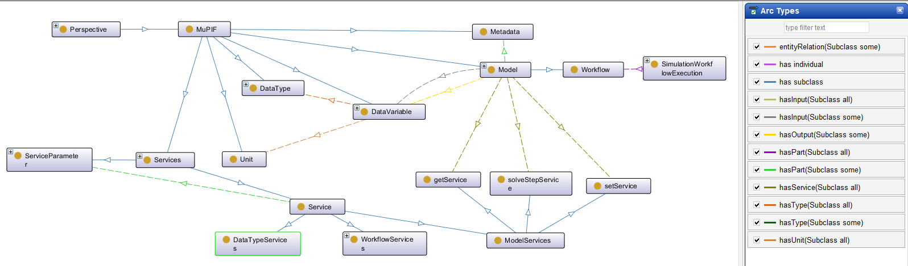
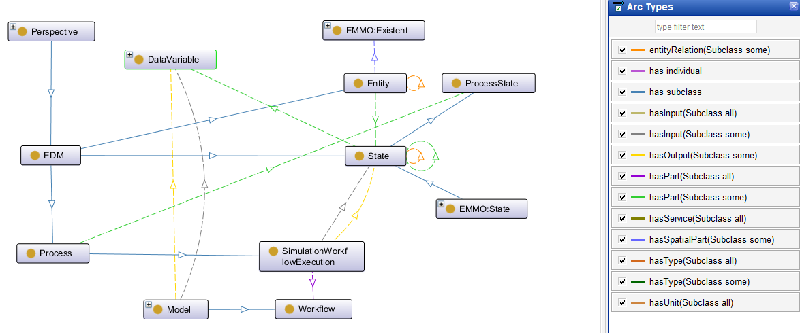
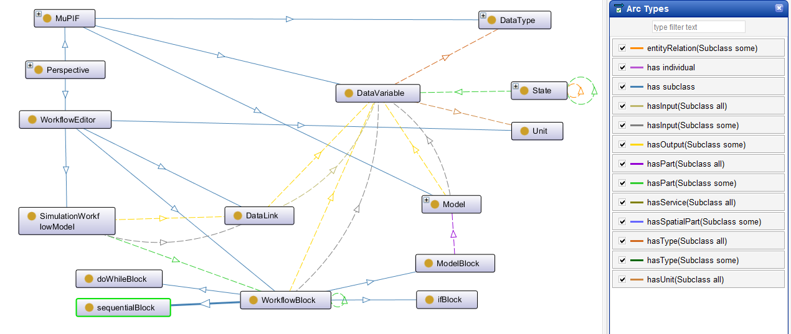

# MuPIF-ontology
MuPIF is open-source, modular, object-oriented integration platform allowing to create complex, distributed, multiphysics simulation workflows. This repository  contains ontological model of MuPIF. The ontology is organized into different perspectives. 

In order to be able to view and navigate the MuPIF ontology we recommend to download the Protégé editor from [https://protege.stanford.edu/products.php#desktop-protege](https://protege.stanford.edu/products.php#desktop-protege).

## MuPIF Core Perspective
MuPIF core perspective provides an ontological model of MuPIF. The fundamental MuPIF entities are
* Model - representing the (mathematical) description of a system or process. Model has input and output variables and services that allow to manipulate the model state and steer it.
* Workflow - representing a (complex) simulation build from individual models. Workflow itself is a model, allowing it to be used inside other (more complex) workflows. 
* Variables - represent variables of given type, with defined physical meaning and units.
* DataType - represent data type supported by the platform. All the data exchange within the platform (and within workflows) is performed using variables with DataType type.
* Service - represent (standardized) service provided by MuPIF entities, such as Models, Workflows and individual DataType instances. 
* Metadata - represent metadata describing individual entities. Metadata structure is defined by metadata schema, allowing for validation. 

## EDM Perspective
MuPIF comes with a Data Management System (DMS) called MuPIFDB. The DMS is used to track integrated simulation workflows, their executions including execution inputs and outputs. It also provides a generic Digital Twin model, which is based on the user-defined Entity Data Model (EDM). The EDM identifies the individual entities, their attributes and relations between them. The EDM is defined using JSON schema, and the DMS structure is generated from this schema. When designing the EDM, one should introduce entities and their states, following the EMMO Reductionistic perspective, where states define temporal tesselation. The EDM allows to map state to simulation workflow inputs (determining the initial conditions) and simulation workflow executions (representing a process) outputs can be mapped to new states representing updated configuration(s). The EDM can thus be regarded as hypergraph, where nodes represent entity states and edges representing processes.

## Workflow Editor Perspective
This perspective contains the ontological description of concepts used in MuPIF Workflow editor. The Workflow editor is a graphical tool, which allows users to compose workflow from basic building blocks, while connecting their IO ports. The core entities are following:
* WorkflowBlock - top level class representing generic building block, each block has its input and output slots (with defined physical meaning). Derived entities are, for example:
  * SequentialBlock - representing (sequential) sequence of nested blocks
  * ModelBlock - representing single model execution, the inputs and outputs slots corresponds to Model IO variables
  * DoWhileBlock - represent do while control structure, with condition and execution block to be evaluated while condition holds.
* DataLink - representing a connection between a single source (input)  slot of WokflowBlock and multiple destination (output) slots. DataLink should connect slots of the same type

## Links: 
* mupif/mupif: MuPIF - a modular, object-oriented integration platfor, https://github.com/mupif/mupif
* emmo-repo/EMMO: Elementary Multiperspective Material Ontology (EMMO), https://github.com/emmo-repo/EMMO

## Acknowledgement
This work has been supported by DeeMa project (Deep-Learning and Optimisation Enabled Material Microstructure Design), funded by Technology Agency of the Czech Republic, grant agreement no. TH75020002.  